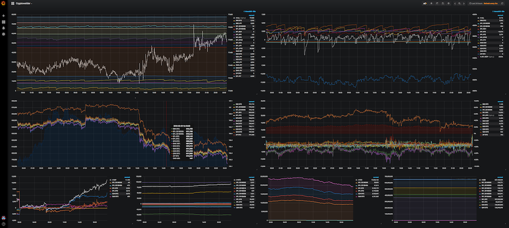

# cryptowelder
[![Build Status][travis-icon]][travis-page] [![Coverage Status][coverall-icon]][coverall-page]

[travis-page]:https://travis-ci.org/after-the-sunrise/cryptowelder
[travis-icon]:https://travis-ci.org/after-the-sunrise/cryptowelder.svg?branch=master
[coverall-page]:https://coveralls.io/github/after-the-sunrise/cryptowelder?branch=master
[coverall-icon]:https://coveralls.io/repos/github/after-the-sunrise/cryptowelder/badge.svg?branch=master

## Overview

**cryptowelder** is a cryptocurrency trade monitoring application to visualize the time series of trading activities, positions, volumes, profits and losses.

1. Extract public market data and private account information from exchange APIs.
2. Transform the extracted data set into its generic data model.
3. Store the transformed data into its time-series database.
4. Visualize the time-series data with various graphs and charts. 

## Feature Highlights

### Multi-Currency, Multi-Exchange
Collect and store data from multiple exchanges for multiple products and multiple currencies. 
Collected data sets are displayed in a single unified view.

### Realtime Visualization & Notification
Time-series data displayed graphs/charts, and are continuously updated in real-time as they are collected. 
Displayed time-windows are configurable on the fly, such as today, last 24h, this week, last N days, and arbitrary time-points from T1 to T2.
Configure custom alerts and notifications. (cf: "Email and/or Slack me if indicator X is Y")

### Web UI
Monitor trading activities from desktops and/or mobile with a standard web browser. 
Drag & drop graphs and components to create custom dashboards.

### Home Currency Conversion
Convert multiple currencies in a single home-currency unit (cf: 1.2 CoinA + 2.3 CoinB + 3.4 CoinC -> 2345.6 JPY).
Which currency to evaluate to, and how to apply the conversions are dynamically configurable. 

### Trade Statistics
Display trading activities such as daily/monthly trading p/l, N-days trading volume per accounts/products.
Track trading activity statistics such as comparing last N-days trading volume as of today versus that of yesterday.

## Getting Started

### Prerequisites
* A REHL-equivalent linux machine with command line interface and direct internet access. Cloud-hosted VM is preferred with at least 2GB memory.
* Python 3.4.x or later with pip. `pyenv` + `pyenv-virtualenv` are recommended.
* PostgreSQL 10.x or later installation, or privileges to install if not already installed.  
* Grafana 5.x or later installation. (Root privilege is not needed for Grafana installation.) 
* Exchange access tokens for private API access. 
* Basic knowledge of Linux for configuration and installation. 
* Basic knowledge of Python and SQL for customization. 

### Mechanics
The application consists of the following components:
* Set of [Python](https://www.python.org/) scripts for scraping data via public/private APIs.
* RDBMS ([PostgreSQL](https://www.postgresql.org/)) for storing the time-series data.
* [Grafana](https://grafana.com/) for visualization and alerting of the time-series data.

### Installation Steps
1. Install and configure PostgreSQL instance. 
    1. Create database `crytowelder`.
    2. Execute the DDL and DML scripts.
    3. Create database user `grafana` and grant read-only access.
2. Configure and build the Python scripts.
    1. Install pip requirements.
    2. Prepare local configuration file with access tokens and scraping policies.
    3. Launch the script to start collecting and storing data into the database.
3. Install and configure Grafana instance.
    1. Configure users and security policies.
    2. Import the dashboard template included.
    3. Access Grafana's web ui with a web browser.
